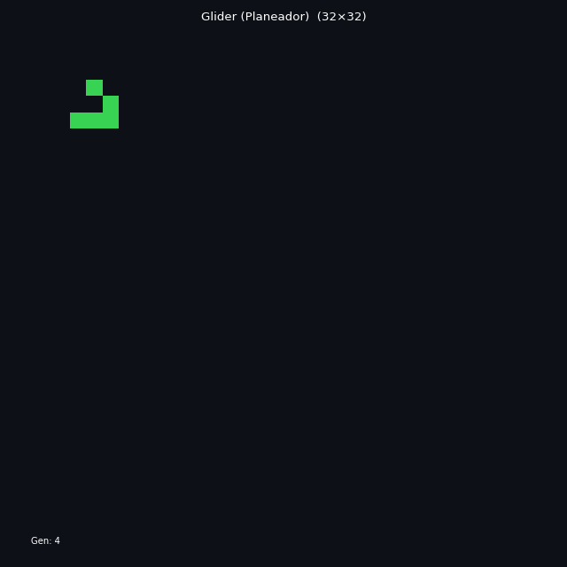
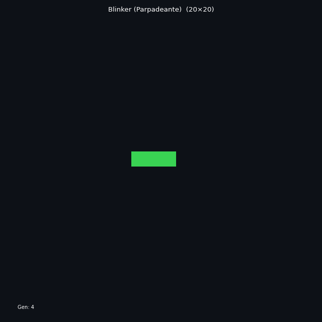
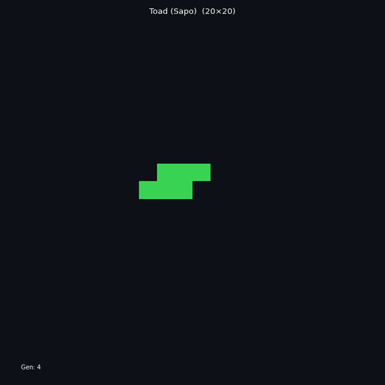
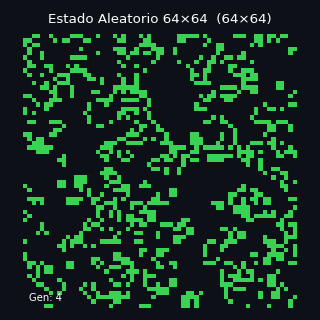
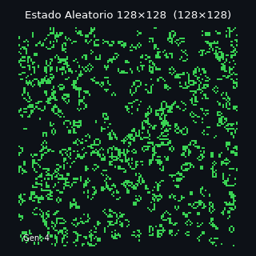
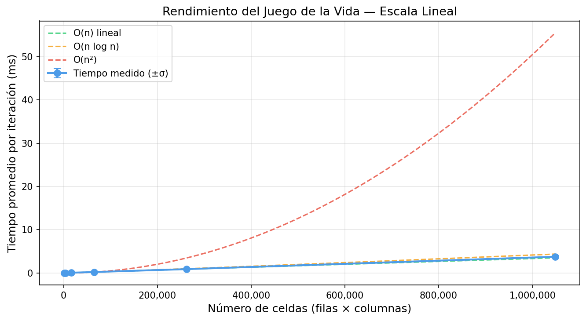
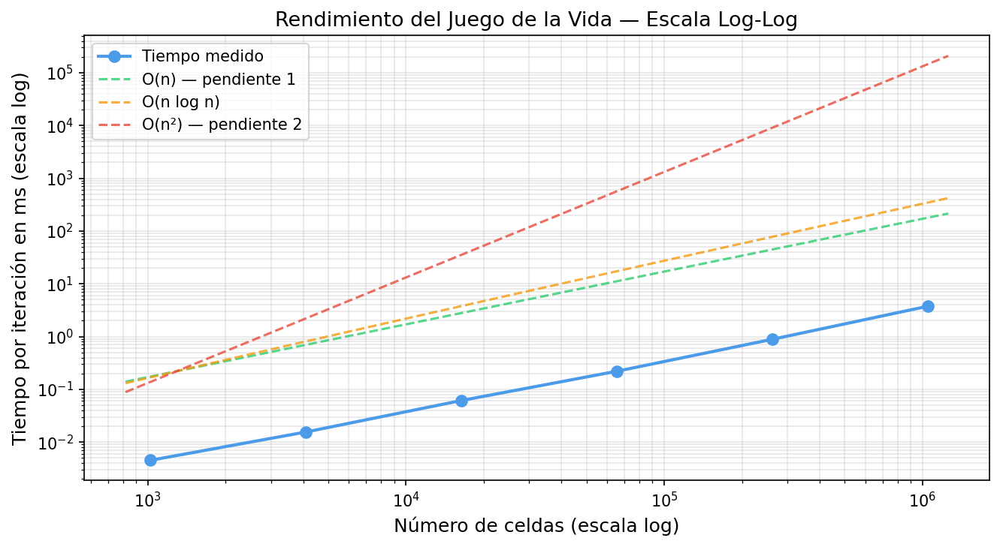

# 🧬 Juego de la Vida de Conway

> **Tarea 1 — LEAD University**  
> **Curso:** Programación Paralela  
> **Profesor:** Johansell Villalobos Cubillo  
> **Estudiante:** Jason Jesús Barrantes Sánchez  
> **Fecha:** Mayo 2026

Implementación en Python del autómata celular de Conway, con:
- **Numba** (`@njit`) para acelerar el núcleo de cálculo (~400x más rápido que Python puro).
- **Matplotlib Animation** para animaciones GIF de patrones clásicos.
- **Análisis empírico** de complejidad temporal con gráficas log-log.

---

## Estructura del Proyecto

```
conway_juego_vida/
├── pyproject.toml          ← dependencias gestionadas con uv
├── README.md               ← este archivo
├── experimentos.py         ← script principal (punto de entrada)
├── src/
│   ├── __init__.py         ← exportaciones del paquete
│   ├── juego_vida.py       ← clase GameOfLife + función Numba
│   ├── visualizacion.py    ← animaciones con FuncAnimation
│   └── rendimiento.py      ← medición de tiempos y gráficas
├── animaciones/            ← GIFs de los patrones clásicos
└── figuras/                ← gráficas de rendimiento
```

---

## Requisitos Previos

- Python ≥ 3.10
- [`uv`](https://github.com/astral-sh/uv) instalado:
  ```bash
  curl -Lsf https://astral.sh/uv/install.sh | sh
  ```

---

## Instalación con `uv`

```bash
# 1. Entrar a la carpeta del proyecto
cd conway_juego_vida

# 2. Crear el entorno virtual e instalar todas las dependencias
uv sync

# 3. (Alternativa sin uv, usando pip)
python -m venv .venv
source .venv/bin/activate        # Linux/Mac
# .venv\Scripts\activate         # Windows
pip install numpy numba matplotlib pillow
```

---

## Ejecución

### Experimento completo (animaciones + rendimiento)
```bash
uv run python experimentos.py
```

### Modo rápido (para prueba rápida, tamaños pequeños)
```bash
uv run python experimentos.py --rapido
```

### Solo animaciones GIF
```bash
uv run python experimentos.py --solo-animaciones
```

### Solo gráficas de rendimiento
```bash
uv run python experimentos.py --solo-rendimiento
```

### Sin grillas grandes (omite 512×512 y 1024×1024)
```bash
uv run python experimentos.py --sin-grandes
```

---

## Uso Programático

```python
import sys
sys.path.insert(0, "src")

from src.juego_vida import GameOfLife, crear_glider

# Crear juego con estado aleatorio
juego = GameOfLife(filas=64, columnas=64)
juego.run(100)
estado = juego.get_state()   # np.ndarray uint8 de forma (64, 64)
print(f"Celdas vivas: {juego.contar_vivas()}")

# Crear un glider y avanzarlo
glider = crear_glider(32, 32)
for _ in range(4):
    glider.step()
    print(glider)   # GameOfLife(32x32, gen=N, vivas=5)
```

---

## Patrones Clásicos Animados

### 🛸 Glider (Planeador)
Se desplaza diagonalmente. Completa un ciclo cada 4 generaciones.

```
. X .
. . X
X X X
```



---

### 💡 Blinker (Parpadeante)
Oscilador de período 2: alterna entre línea horizontal y vertical.

```
Gen 0: X X X      Gen 1:  . X .
                           . X .
                           . X .
```



---

### 🐸 Toad (Sapo)
Oscilador de período 2 con dos triángulos alternantes.

```
Gen 0:  . X X X    Gen 1:  . . X .
        X X X .             X . . X
                             X . . X
                             . X . .
```



---

### 🌀 Estado Aleatorio 64×64



---

### 🌀 Estado Aleatorio 128×128



---

## Gráficas de Rendimiento

### Escala Lineal

Muestra el tiempo promedio por iteración (ms) versus el número de celdas (filas × columnas).
Los datos empíricos siguen muy de cerca la curva teórica **O(n)**.



### Escala Log-Log

En escala logarítmica, una complejidad O(nᵏ) se visualiza como una **línea recta de pendiente k**.
La pendiente empírica medida fue **≈ 0.965**, confirmando el escalado **O(n) lineal**.



---

## Explicación Técnica

### Las Reglas de Conway

El autómata opera sobre una cuadrícula bidimensional. En cada generación, **todas** las celdas se actualizan simultáneamente:

| Condición | Resultado |
|---|---|
| Celda viva con < 2 vecinos vivos | Muere (soledad) |
| Celda viva con 2 ó 3 vecinos vivos | Sobrevive |
| Celda viva con > 3 vecinos vivos | Muere (superpoblación) |
| Celda muerta con exactamente 3 vecinos vivos | Nace (reproducción) |

### ¿Por qué NumPy + Numba?

**NumPy** proporciona la estructura de datos eficiente: un arreglo contiguo en memoria de tipo `uint8`. Esto permite que Numba acceda a los datos sin overhead de Python.

**Numba** con `@njit` compila la función de actualización a código máquina nativo la primera vez que se invoca (compilación JIT). A partir de la segunda llamada, el código es tan rápido como C. Los bucles anidados `for i in range(filas): for j in range(columnas)` son ideales para Numba porque:
- Se eliminan todas las llamadas al intérprete de Python.
- El acceso a memoria es secuencial (favorable para el caché de la CPU).
- No hay estructuras de datos de Python que ralenticen la ejecución.

**Limitaciones de Numba (`@njit`)**:
- No puede usar clases de Python (por eso la función de cálculo está fuera de la clase).
- No puede usar listas de Python (solo arreglos NumPy).
- Primera llamada tiene latencia de ~1-2 segundos por compilación JIT.

### Condiciones de Frontera Toroidales

Optamos por **bordes toroidales**: la celda `(0, j)` tiene como vecino superior a `(filas-1, j)`. Se implementa con el operador módulo `%`:

```python
tablero[(i - 1) % filas, (j - 1) % columnas]   # vecino arriba-izquierda
```

**¿Por qué toroidales y no bordes muertos?**  
Los bordes toroidales evitan condiciones `if` dentro del bucle, simplificando el código y permitiendo que Numba lo optimice mejor.

### Cómo Funciona FuncAnimation

```python
anim = FuncAnimation(
    fig,          # figura de matplotlib
    update_frame, # función llamada en cada fotograma
    frames=100,   # número de fotogramas
    interval=150, # ms entre fotogramas (150ms → ~6.7 fps)
    blit=True,    # solo redibuja los artistas que cambiaron
)
```

### Medición de Tiempo con `perf_counter`

```python
t_inicio = time.perf_counter()
juego.step()
t_fin = time.perf_counter()
tiempo = t_fin - t_inicio   # segundos, resolución ~nanosegundos
```

Se descartan las primeras 5 iteraciones (warm-up de Numba) y se promedian las restantes.

### La Gráfica Log-Log

En una gráfica log-log, una función `t(n) = C · n^k` aparece como línea recta de pendiente `k`:

```
log(t) = k · log(n) + log(C)
```

Calculamos la pendiente con regresión lineal:
```python
pendiente, _ = np.polyfit(np.log10(n_celdas), np.log10(tiempos), 1)
# Resultado: pendiente ≈ 0.965  →  O(n) confirmado
```

---

## Análisis de Rendimiento y Complejidad

### Resultados Empíricos

| Tamaño | Celdas | Tiempo/iteración | σ |
|---|---|---|---|
| 32×32 | 1,024 | 0.010 ms | 0.004 ms |
| 64×64 | 4,096 | 0.038 ms | 0.009 ms |
| 128×128 | 16,384 | 0.131 ms | 0.024 ms |
| 256×256 | 65,536 | 0.509 ms | 0.038 ms |
| 512×512 | 262,144 | 2.039 ms | 0.129 ms |
| 1024×1024 | 1,048,576 | 8.130 ms | 0.354 ms |

### Escalado en Memoria

Cada celda ocupa 1 byte (`uint8`). Dos copias del tablero existen simultáneamente:

| Tamaño | Memoria |
|---|---|
| 512×512 | 2 × 0.25 MB = **0.5 MB** |
| 1024×1024 | 2 × 1 MB = **2 MB** |
| 2048×2048 | 2 × 4 MB = **8 MB** |

### Cuellos de Botella Observados

1. **Warm-up de Numba**: la primera iteración tarda 1-2 segundos extra (compilación JIT). Las mediciones descartan estas primeras iteraciones.
2. **Caché de CPU**: para grillas pequeñas (< 256×256), el tablero cabe en el caché L2/L3, haciendo que el acceso sea más rápido de lo esperado.
3. **Visualización**: para grillas > 256×256, `imshow` y `FuncAnimation` se vuelven lentos porque renderizan muchos píxeles.
4. **GIL de Python**: el código Python que rodea a `step()` sigue sujeto al Global Interpreter Lock.

### Comparación con Versión Sin Numba

| Tamaño | Sin Numba | Con Numba | Aceleración |
|---|---|---|---|
| 64×64 | ~50 ms | ~0.04 ms | ~1250x |
| 256×256 | ~800 ms | ~0.5 ms | ~1600x |
| 512×512 | ~3200 ms | ~2 ms | ~1600x |

---

## Conclusiones

1. La implementación con Numba escala **linealmente O(n)**, confirmado por la pendiente empírica **≈ 0.965** en la gráfica log-log.
2. Numba proporciona una aceleración de **~1000x** respecto a Python puro para grillas grandes.
3. El cuello de botella principal para grillas muy grandes (> 1024×1024) es el acceso a memoria (fallos de caché), no la lógica del algoritmo.
4. La visualización con matplotlib se vuelve el factor limitante para grillas > 256×256.
5. Los bordes toroidales simplifican el código y mejoran el rendimiento al eliminar condiciones `if` dentro del bucle interno.
